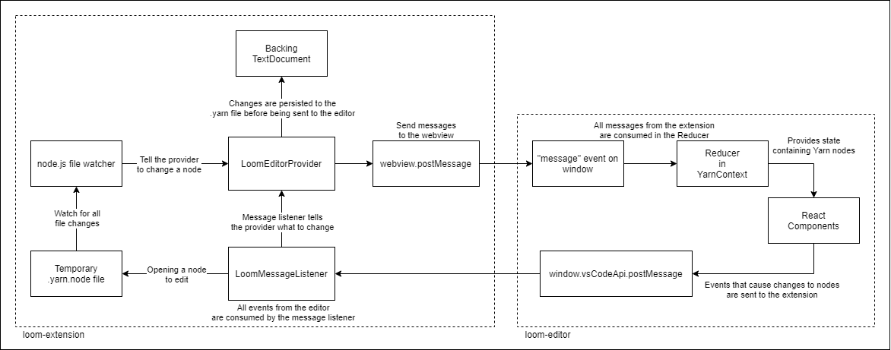

# Contributing

This document outlines how to contribute to this project, as well as an overview of the project layout and structure.

- [Contributing](#contributing)
  - [Requirements](#requirements)
  - [Getting Started](#getting-started)
  - [Testing](#testing)
  - [How to Contribute](#how-to-contribute)
    - [CI/CD](#cicd)
    - [Packaging the extension](#packaging-the-extension)
  - [Project Layout](#project-layout)
    - [`loom-common`](#loom-common)
    - [`loom-editor`](#loom-editor)
    - [`loom-extension`](#loom-extension)
      - [Temporary files and editing specific nodes](#temporary-files-and-editing-specific-nodes)
    - [Communication between `loom-extension` and `loom-editor`](#communication-between-loom-extension-and-loom-editor)

## Requirements

To develop this project, you need to have the following installed:

- [Visual Studio Code](https://code.visualstudio.com/)
- [node.js and npm](https://nodejs.org/en/)

## Getting Started

Clone this repo, and then open it up in Visual Studio Code.

Install dependencies by running `npm install` at the root of the project. If you run into issues (i.e. with `ENOACCESS`) then try running `npm install` in subdirectories first, then running it again at the root.

To run the extension in the extension development host, use Visual Studio Code's [debug launcher](https://code.visualstudio.com/docs/editor/debugging) to launch the "Extension" configuration.

Or, you can press <kbd>F5</kbd> to launch it automatically.

## Testing

Tests are all done using [jest](https://jestjs.io/).

In `loom-editor`, [`react-testing-library`](https://testing-library.com/docs/react-testing-library/intro) is also used.

To run tests in all sub-projects, run `npm test` at the root of the repo.

To run tests against a specific subproject:

- `npm run test:common`
- `npm run test:editor`
- `npm run test:extension`

**NOTE:** Running `npm test` inside one of the subprojects will **not** work since the necessary dependencies are located in the root `package.json` and are bootstrapped in the subprojects by lerna.

If actively working on `loom-editor`, it is often best to run `../node_modules/.bin/react-scripts test` to get the interactive test runner.

## How to Contribute

To contribute to this repo, [fork it](https://docs.github.com/en/github/getting-started-with-github/fork-a-repo), make changes and open up a pull request.

[Issues are also welcome!](https://github.com/TranquilMarmot/YarnLoom/issues)

### CI/CD

TODO Github Actions

### Packaging the extension

To manually generate a `.vsix` file, run `npm run package` at the root of the repo.

**Note:** Sometimes, weird things can happen with lerna and `node_modules`; if you run into weird issues here, try `cd loom-extension && rm -rf node_modules && npm install` to clean things out and make sure you have all the dependencies needed.

This should generate a `loom-extension-X.X.X.vsix` file. In general, it is a good idea to append the current Git commit to this filename. This is just a `.zip` file, so if you want to upload it i.e. to GitHub to share in a comment, you can rename it to `.zip`.

To install the `.vsix` file, run `code --install-extension {your .vsix file}`.

## Project Layout

This project is a monorepo that is managed with [lerna](https://lerna.js.org/).

Where possible, dev dependencies are kept at the root level of the project.

All code is written in [TypeScript](https://www.typescriptlang.org/).

There are three main components to this project...

### `loom-common`

`loom-common` contains common code that is shared between `loom-editor` and `loom-extension`.

This includes:

- [`EditorActions.ts`](./loom-common/EditorActions.ts) which is used to communicate between the editor and the extension (see the section on communication below)
- [`YarnNode.ts`](./loom-common/YarnNode.ts) which contains type definitions and some utility functions for parsing/generating Yarn nodes
- [`YarnParser.ts`](./loom-common/YarnParser.ts) which contains the code that parses a Yarn file into a list of `YarnNode`s.

### `loom-editor`

`loom-editor` is a React single-page app (SPA) created using [create-react-app](https://github.com/facebook/create-react-app).

It uses [react-d3-graph](https://github.com/danielcaldas/react-d3-graph) for node rendering and [emotion](https://github.com/emotion-js/emotion) for its styling.

It is worth noting that, while this is a React SPA, it can _only_ be run within the context of the extension. Without the extension host, the SPA is essentially useless.

### `loom-extension`

`loom-extension` contains the extension host code that Visual Studio Code runs when the extension is activated.

This is done using a [webview](https://code.visualstudio.com/api/extension-guides/webview) with the [custom editor API](https://code.visualstudio.com/api/extension-guides/custom-editors).

Basically, when you open a `.yarn` file, the extension opens up a sandboxed Google Chrome window and loads the `loom-editor` into it. Most of the config for this lives in the [extension's `package.json](./loom-extension/package.json). It contributes a custom editor that activates when `.yarn` or `.yarn.txt` files are opened.

[`extension.ts`](./loom-extension/src/extension.ts) is called when the extension activates and it registers a [`LoomEditorProvider`](./loom-extension/src/LoomEditorProvider.ts) which uses the [`LoomWebviewPanel`](./loom-extension/src/LoomWebviewPanel.ts) to render the `loom-editor`.

#### Temporary files and editing specific nodes

Currently, Visual Studio Code does not have a way for extensions to open up ephemeral files to be edited; as such, when opening a Yarn node, the extension host will actually write a file out to disc representing the Yarn node.

It does this in the node.js provided [`os.tmpdir()`](https://nodejs.org/api/os.html#os_os_tmpdir), suffixed with a hashed string representing the node's location within the project structure.

After writing the file, it starts a node.js file watcher on it; whenever the file changes, updates are sent back to the extension and then subsequently back to the editor. It then opens the file in Visual Studio Code. This ends up working surprisingly well.

The extension tries its best to keep track of temporary files that it creates and delete them when the `.yarn` file or the Visual Studio Code window is closed.

See [`TemporaryFiles.ts`](./loom-extension/src/TemporaryFiles.ts) for more information.

### Communication between `loom-extension` and `loom-editor`

It's helpful to think of `loom-extension` as the server and `loom-editor` as the client. The extension has a representation of the currently open file open and the editor sends events to it to update specific nodes.

In the webview, `window.vsCodeApi` is created by calling `acquireVsCodeApi();` in [`LoomWebviewPanel`](./loom-extension/src/LoomWebviewPanel.ts). This is basically hakced into the `<head>` tag of the document.

The "Backing `TextDocument`" is the actual `.yarn` file that is currently being edited. When nodes are changed/added/removed, the `LoomEditorProvider` is smart enough to know which exact lines to change in the text document for the node. This allows for native undo/redo for all changes that are applied to the document itself.

All messages being sent via `window.vsCodeApi.postMessage` from the editor to the extension and all messages being sent via `webview.postMessage` from the extension back to the editor defined in `loom-common` as [`EditorActions`](./loom-common/EditorActions.ts). This ensures type safety in all messages being sent back and forth.
