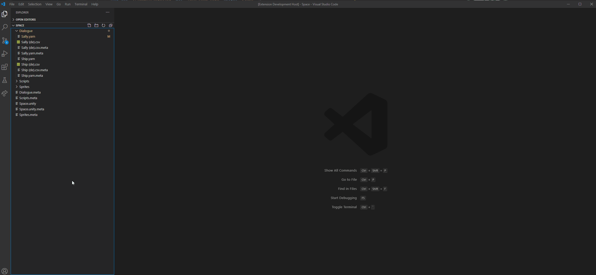
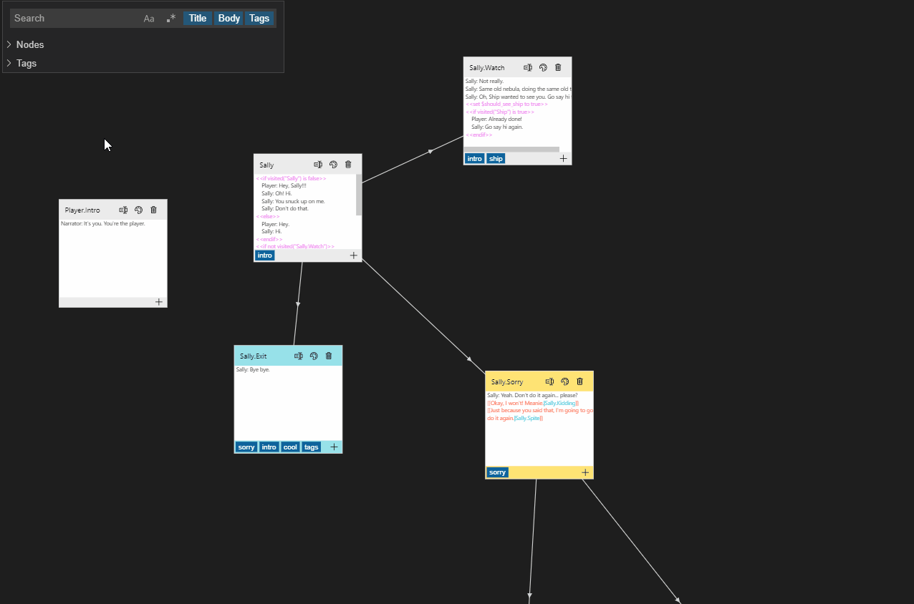

# Yarn Spinner Loom Visual Studio Code Extension

  

Yarn Loom is a Visual Studio Code extension for editing [yarn files](https://yarnspinner.dev/). It is a re-imagining of the [Yarn Editor](https://github.com/YarnSpinnerTool/YarnEditor) built from the ground up to integrate seamlessly with Visual Studio Code.

- [Yarn Spinner Loom Visual Studio Code Extension](#yarn-spinner-loom-visual-studio-code-extension)
  - [Installing](#installing)
  - [Usage](#usage)
  - [Reporting Issues/Bugs, Contributing, and Technical Details](#reporting-issuesbugs-contributing-and-technical-details)
  - [How To](#how-to)
    - [Editing nodes](#editing-nodes)
    - [Renaming nodes](#renaming-nodes)
    - [Changing node tags](#changing-node-tags)
    - [Changing a node's color](#changing-a-nodes-color)
    - [Changing a node's position](#changing-a-nodes-position)
    - [Adding new nodes](#adding-new-nodes)
    - [Deleting nodes](#deleting-nodes)
    - [Searching](#searching)
      - [Quick tag search](#quick-tag-search)
    - [Switching between the graph editor and a text editor](#switching-between-the-graph-editor-and-a-text-editor)
    - [Theme support](#theme-support)
  - [Keyboard Shortcuts](#keyboard-shortcuts)
  - [Special Thanks](#special-thanks)

## Installing

This extension can be installed from the [Visual Studio Code Extension Marketplace](https://marketplace.visualstudio.com/items?itemName=TranquilMarmot.yarn-spinner-loom)

## Usage

Once the extension is installed, simply open up a `.yarn` or a `.yarn.txt` file to use it!

## Reporting Issues/Bugs, Contributing, and Technical Details

If you find any issues or bugs with this extension, [please open up a new issue on the GitHub repo](https://github.com/TranquilMarmot/YarnLoom/issues/new/choose) and include as much detail as possible!

For in-depth technical details on how this extension works, and how to contribute to it yourself, see [CONTRIBUTING.md](./CONTRIBUTING.md).

## How To

Each of the examples below has an expandable gif that shows the editor in action.

### Editing nodes

To edit a node, double click it. This will open the node up in a text editor next to the open `.yarn` file.

Changes saved in this text editor will be reflected in the `.yarn` file editor. Saving the open `.yarn` file will persist changes to disk, and undo/redo can be used to move back and forth between edits to a node.

  
Expand for demo of editing nodes

  

### Renaming nodes

A node can be renamed by clicking on the rename icon ()

Any nodes that are linking to a node will have their links automatically updated when a node is renamed.

An error message will be shown if there is already a node with the entered name.

  
Expand for demo of renaming a node

  

### Changing node tags

Tags can be added/removed by clicking the add icon () on the bottom of a node.

Existing tags will be shown in a list and can be toggled on and off.

To add new tags, click the "+ Add Tags" button. You can then enter a list of space-separated tags here and they will all be added to the node.

  
Expand for demo of changing node tags

  

### Changing a node's color

Node colors can be changed by clicking the color change icon ().

This will bring up a list of colors to choose from. The `colorID` that you see when opening a node in the text editor corresponds to a color in this list.

  
Expand for demo of changing a node's color

  

### Changing a node's position

A node's position can be changed by dragging it around in the graph view of the `.yarn` file.

  
Expand for demo of changing a node's position

  

### Adding new nodes

New nodes are added automatically when you link to them when editing node text.

You can also add new nodes by opening up the node list, scrolling to the bottom, and clicking "Add new node".

  
Expand for demo of adding a new node

  

### Deleting nodes

Nodes can be deleted by clicking the garbage can/trash icon in the their title () . A confirmation message will be displayed.

  
Expand for demo of deleting a node

  

### Searching

The search bar can be used to search for specific nodes.

When searching, nodes that do not contain the search term will be dimmed. Nodes containing the search term will stay opaque.

The "Title", "Body", and "Tags" buttons in the search bar control whether or not to search within node titles, bodies, and tags, respectfully. This is an "or" search, so if searching in all three locations and one node has "Sally" in the title, one has "Sally" in the body, and one has a tag of "Sally", then all three will show up in the search. Note that turning off all three options effectively disables the search.

There are also two buttons to enable/disable case sensitivity () and regular expressions (). Regular expressions are only run on enabled search contexts ("Title", "Body", and/or "Tags") and are done via JavaScript's built-in `RegExp` functionality, so anything regular expressions that work in JavaScript will work. [The MDN Web Docs have a nice regular expression cheat-sheet available](https://developer.mozilla.org/en-US/docs/Web/JavaScript/Guide/Regular_Expressions/Cheatsheet).

  
Expand for demo of searching for nodes

  

#### Quick tag search

To quickly search for a tag, you can either click on it in the footer of a node or expand the tag list and select it from there. This will automatically fill in the search box with the tag and limit the search to tags.

Re-selecting the tag that is currently being searched for will de-select it and reset the search box.

  
Expand for demo of quick tag searching

  

### Switching between the graph editor and a text editor

Switching editors can be done with the [command palette](https://code.visualstudio.com/docs/getstarted/userinterface#_command-palette), <kbd>Ctrl</kbd> + <kbd>Shift</kbd> + <kbd>P</kbd>, and selecting the "View: Reopen Editor With..." option.

In this menu, selecting "Configure default editor for '\*.yarn'..." will let you set the default editor for `.yarn` files. This is useful if you want Visual Studio Code to default to opening files with the text editor.

  
Expand for demo of switching between the text editor and Yarn Loom

  

### Theme support

This extension should fully support all Visual Studio Code themes. Better and more integrated theme support will be added gradually.

If there is a theme where something doesn't look right or is unreadable, please don't hesitate to [open up a new issue on the GitHub repo](https://github.com/TranquilMarmot/YarnLoom/issues/new/choose).

  
Expand for demo of switching themes

  

## Keyboard Shortcuts

| Shortcut                        | Description         |
| ------------------------------- | ------------------- |
| <kbd>Ctrl</kbd> + <kbd>F</kbd>  | Focus on search bar |
| <kbd>Shift</kbd> + <kbd>+</kbd> | Add new node        |

## Special Thanks

The syntax highlighting portion of this extension was copied over from the [Yarn VSCode Extension](https://github.com/YarnSpinnerTool/VSCodeExtension) and all credit for it goes to [@desplesda](https://github.com/desplesda).

Portions of Yarn file parsing and in-editor highlighting were copied over from the [Yarn Editor](https://github.com/YarnSpinnerTool/YarnEditor) and all credit for it goes to the Yarn Editor contributors, but especially [@blurymind](https://github.com/blurymind).

The original [Yarn Spinner logo](https://yarnspinner.dev/img/YarnSpinnerLogo.png) was made by [Cecile Richard](https://www.cecile-richard.com/) and was remixed to create the logo for this extension.
